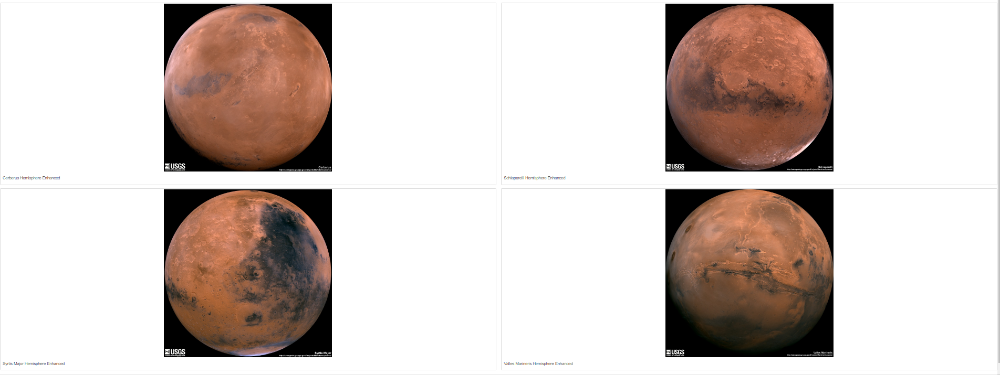

# Mission to Mars

## Purpose
The purpose of this project was to scrape websites and build a new site.  We used two different site for scraping.  During the exercises we scraped the following:

1. redplanetscience.com to locate a recent article for our webpage.  We used:
    * The title of the most recent article.
    * A summary of the article.
2. spaceimages-mars.com to locate a recent image for our webpage.
3. galaxyfacts-mars.com to locate fun facts about mars that were put in a table from a DataFrame for easy visualization.

## Challenge 

Deliverable one of challenge reqired a search for images on marshemispheres.com for four images of mars.  This was accomplished by adding code to the scraping.py file to scrape the website for the images. (first validating that the code written for this portion worked in jupyter notebook)

Deliverable two added code to the index.html file that would add the images to the website.

Finally, in deliverable three asked for us to add formatting to the site using code from bootstraps. I added some simple formatting by underlining the title of the site and changing the color of the scraping button.  I also worked to ensure that the site was mobile responsive.

I tried to a carousel to the hemisphere images so that the site would also be interactive.  I was unsuccessful, but will keep trying.